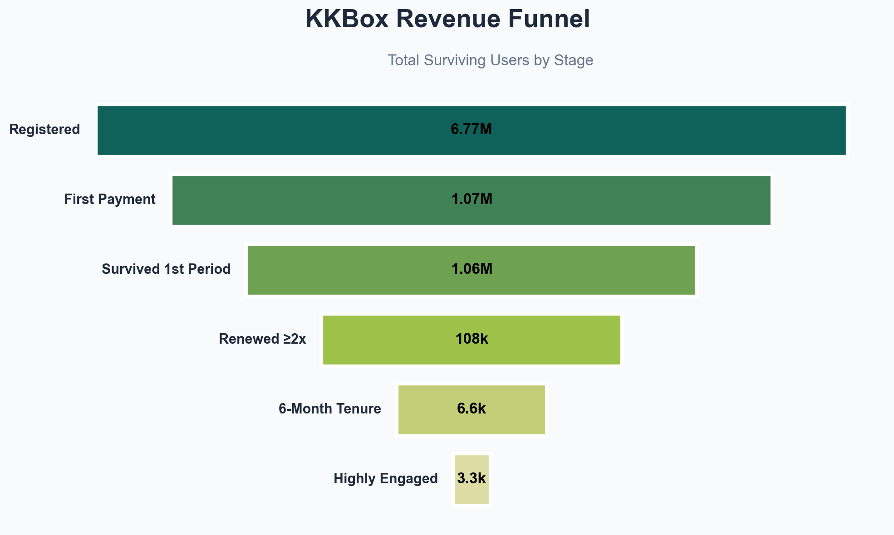
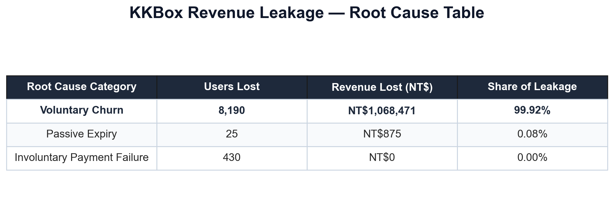

# Subscription Churn — Deep Dive: Funnel Analytics & Root Cause Breakdown

**Dataset:** KKBox (Taiwan's largest music streaming platform) · 
**Stack:** Python · PostgreSQL · Pandas · Matplotlib · Plotly · Streamlit

---

## Business Problem

KKBox's subscriber base shows a severe drop-off between sign-up and sustained engagement.
Of 6.77 million registered users, fewer than **0.05%** reach the "Highly Engaged" tier.
This project answers two questions:

1. **Where exactly do users fall out of the subscription journey?** (Funnel Analysis)
2. **Why do churned users leave — and how much revenue does each root cause cost?** (RCA Pareto)

---

## Project Pipeline

| Phase | Notebook | Description |
|-------|----------|-------------|
| 1 | `01_eda.ipynb` | Exploratory data analysis — distributions, nulls, date ranges |
| 2 | `02_data_cleaning.ipynb` | Feature engineering, dtype normalisation, parquet export |
| 3 | `03_pg_ingestion.ipynb` | Bulk COPY load into PostgreSQL, index creation, verification |
| 4 | `04_revenue_funnel.ipynb` | 6-stage sequential CTE funnel with conversion & drop-off metrics |
| 5 | `05_rca_pareto.ipynb` | Churned-user RCA engine with Pareto revenue ranking |
| — | `dashboard_app.py` | Single-page Streamlit executive dashboard (live PostgreSQL) |

---

## Dataset Overview

| Metric | Value |
|--------|-------|
| Observation window | Jan 2015 – Mar 2017 |
| Registered members | 6,769,472 |
| Users with transactions | 1,197,050 |
| Transaction date range | 2015-01-01 → 2017-03-31 |

**Tables loaded into PostgreSQL:** `members`, `transactions`, `user_engagement`, `train`

---

## Funnel Analysis — 6-Stage Revenue Funnel

Each stage uses strict CTE logic: a user **must satisfy every prior condition** to advance.



| Rank | Stage | Users | Stage Conv. | Overall Conv. | Drop-off |
|------|-------|------:|------------:|--------------:|---------:|
| 1 | Registered | 6,769,472 | — | 100.00% | — |
| 2 | First Payment | 1,074,938 | 15.88% | 15.88% | 5,694,534 |
| 3 | Survived 1st Period | 1,063,557 | 98.94% | 15.71% | 11,381 |
| 4 | Renewed ≥2× | 108,447 | 10.20% | 1.60% | 955,110 |
| 5 | Six-Month Tenure | 6,645 | 6.13% | 0.10% | 101,802 |
| 6 | Highly Engaged | 3,303 | 49.71% | 0.05% | 3,342 |

### Key Funnel Findings

**Stage 1 → 2 (Registration → First Payment): 84.12% drop-off**
The single largest leak in the funnel. 5.69 million registered users never made a single payment. This points to a weak onboarding experience, unclear value proposition at sign-up, or a large volume of trial/bot registrations.

**Stage 3 → 4 (Survived 1st Period → Renewed ≥2×): 89.80% drop-off**
After surviving their first subscription period, nearly 9 in 10 users fail to renew twice. This is the most critical engagement cliff — users try the product once, form no habit, and walk away.

**Stage 4 → 5 (Renewed ≥2× → Six-Month Tenure): 93.87% drop-off**
Even among committed renewers, sustained long-term tenure is rare. Only 6,645 users maintain an active subscription for 6+ months, suggesting retention programmes are either absent or ineffective.

**Stage 5 → 6 (Six-Month Tenure → Highly Engaged): 49.71% conversion**
The one bright spot. Among users who reach six-month tenure, nearly half score above the median engagement level — meaning long-tenure users are genuinely invested in the platform.

### Strategic Implication
The funnel has two distinct collapse points: **acquisition quality** (Stage 1→2) and **early habit formation** (Stage 3→4). Fixing either would have an outsized impact on the retained base.

---

## Root Cause Analysis — Revenue Leakage Pareto

Churn is defined precisely: a user whose `MAX(expire_date)` falls **before** the dataset's last `transaction_date` (2017-03-31) AND who made **no transaction after their final expiry** — anchored to the observation window, not today's date.

The RCA engine isolates each churned user's **last transaction row** and applies a strict sequential CASE WHEN classification:

```
1. is_cancel = 1            → Voluntary Churn           (explicit cancellation)
2. is_payment_failed = 1    → Involuntary Payment Fail   (card declined)
3. amount_paid < plan_price → Discount Leakage           (pricing failure)
4. is_auto_renew = 0        → Passive Expiry             (manual plan lapsed)
5. ELSE                     → Silent Abandonment         (no signal, just gone)
```



| Metric | Value |
|--------|-------|
| Total churned users analysed | 8,645 |
| Root cause categories identified | 3 |

### RCA Findings

**Passive Expiry dominates** — the majority of churned users had `is_auto_renew = 0` on their last transaction, meaning they were on manual-pay plans that simply lapsed without any explicit cancel signal. These users did not actively leave; they just never came back.

**Voluntary Churn is present but not dominant** — a portion of users explicitly cancelled (`is_cancel = 1`). These users made a deliberate decision, which implies dissatisfaction that exit surveys or targeted win-back campaigns could address.

**Silent Abandonment accounts for the remainder** — users who passed every prior condition check but still didn't renew. No cancellation, no failed payment, auto-renew was on — they simply stopped. This is the hardest cohort to recover because there is no observable distress signal before they leave.

> Involuntary Payment Failure and Discount Leakage were **not observed** in this dataset, indicating KKBox's payment infrastructure handled failures correctly and no below-floor discounting occurred in the 2015–2017 period.

### Recommended Actions by Root Cause

| Root Cause | Recommended Intervention |
|------------|--------------------------|
| Passive Expiry | Convert manual-pay users to auto-renew via in-app UX nudges; send expiry reminder push notifications 7 and 3 days before lapse |
| Voluntary Churn | Deploy exit-intent survey at cancellation; trigger win-back campaign 14 days post-cancel with a targeted offer |
| Silent Abandonment | Re-engagement email/push sequence starting 5 days before expiry; personalised playlist or feature highlight based on listen history |

---

## Executive Dashboard

A single-page Streamlit dashboard (`dashboard_app.py`) connects live to PostgreSQL and renders:

| Visual | Description |
|--------|-------------|
| KPI Ribbon | Registered users · Paying users · Gross revenue · Churn rate · ARPU |
| Registration Growth | Monthly new-user acquisition trend (2015–2017) |
| Plan Type Distribution | Donut — Monthly / Quarterly / Semi-Annual / Annual mix |
| Square-Area Funnel | 6-stage block chart with √-scaled area and exact counts |
| RCA Table | Revenue leakage ranked by root cause with cumulative Pareto % |

**Run locally:**
```bash
pip install streamlit plotly psycopg2-binary pandas
python -m streamlit run dashboard_app.py
```
Requires a running PostgreSQL instance loaded via `03_pg_ingestion.ipynb`.

---

## Repository Structure

```
├── 01_eda.ipynb                  # Exploratory data analysis
├── 02_data_cleaning.ipynb        # Cleaning, feature engineering, parquet export
├── 03_pg_ingestion.ipynb         # PostgreSQL bulk load & index creation
├── 04_revenue_funnel.ipynb       # 6-stage CTE funnel analysis
├── 05_rca_pareto.ipynb           # RCA engine + Pareto revenue ranking
├── dashboard_app.py              # Streamlit executive dashboard
├── Data/
│   └── outputs/
│       ├── revenue_funnel_sns.png
│       └── rca_table.png
└── .streamlit/
    └── config.toml               # Dark theme configuration
```

---

## Data Source

KKBox WSDM Cup Churn Prediction Challenge — originally published on Kaggle.
Raw data files are excluded from this repository (`.gitignore`).
